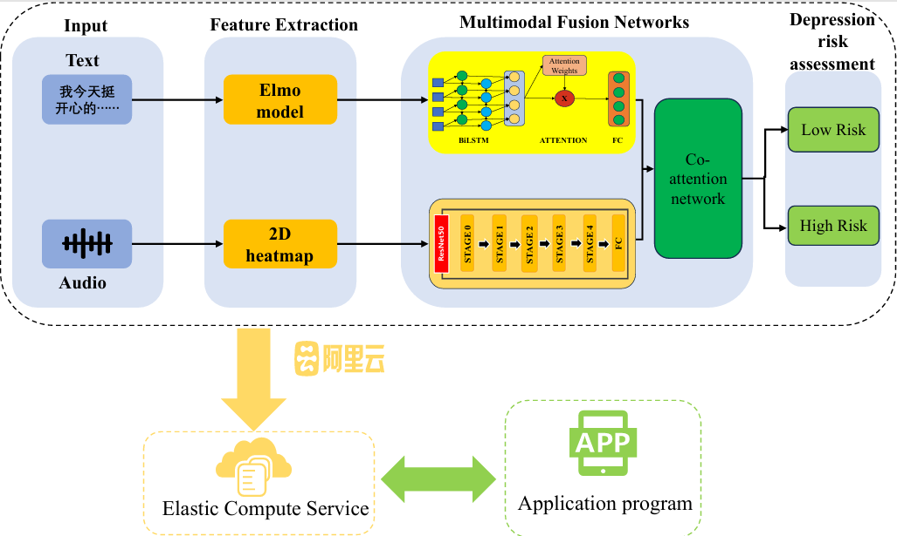
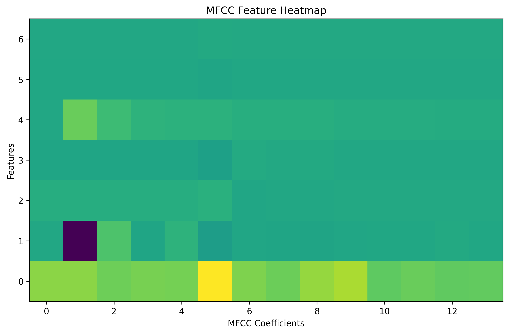
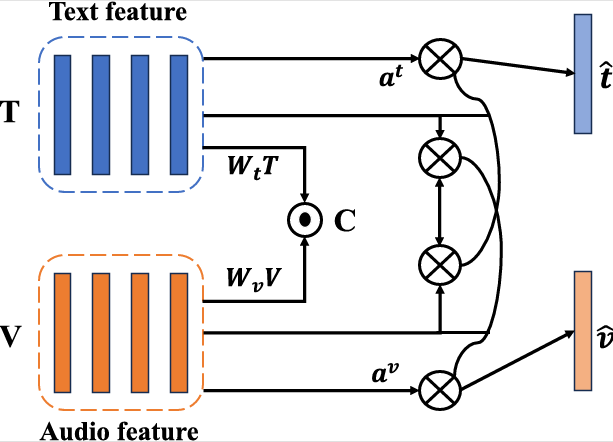

# mDRA: A Multimodal Depression Risk Assessment Model Using Audio and Text

[](https://doi.org/10.1109/LSP.2025.3567028)

This repository contains the official implementation of the **mDRA** framework as proposed in our IEEE Signal Processing Letters 2025 article:  
**"mDRA: A Multimodal Depression Risk Assessment Model Using Audio and Text"**  
by Longhui Zhou, Bin Hu, and Zhi-Hong Guan.

---

## 🧠 Overview

mDRA is a deep learning-based system that jointly leverages **audio and text** modalities to assess depression risk with high accuracy and interpretability. The system integrates:

- ELMo embeddings + BiLSTM with attention for textual understanding  
- ResNet50 on 2D heatmaps of audio features (MFCC + F0)  
- A **collaborative attention mechanism** to fuse and adaptively weight both modalities

<p align="center">
  
</p>

---

## 🔍 Key Features

- 🔊 Converts speech into 2D heatmaps capturing acoustic patterns
- 📖 Uses BiLSTM + attention for semantic feature learning
- 🔁 Applies collaborative attention to bridge audio-text features
- 📱 Deploys a cloud-based interface for mobile depression screening

---

## 📁 Project Structure

```

mDRA-framework/
│
├── data/                   # Scripts or pointers for DAIC-WoZ and EATD-Corpus
├── models/                 # Saved models, checkpoints
├── modules/                # BiLSTM, ResNet50, attention modules
├── utils/                  # Feature extraction, visualization tools
├── image/                 # Figures used in README and documentation
│   ├── mDRA\_framework.png
│   ├── heatmap\_example.png
│   └── ui\_interface.png
├── main.py                # Training entry point
└── README.md

```

---

## 🧪 Datasets

We evaluate mDRA on:

- **EATD-Corpus** (Chinese): 158 participants, SDS-labeled  
- **DAIC-WoZ** (English): 142 participants, PHQ-8 labeled  

> Note: Access to datasets may require agreement with dataset providers.

---

## 📈 Performance

| Dataset     | Metric | mDRA (Ours) | Best Baseline |
|-------------|--------|-------------|---------------|
| EATD-Corpus | F1     | **0.94**    | 0.76 (BiLSTM) |
| DAIC-WoZ    | F1     | **0.88**    | 0.85 (ACMA-Net) |

<p align="center">
  
</p>

---

## 🧠 Attention Mechanism

The collaborative attention network effectively bridges semantic and acoustic features.

<p align="center">
  
</p>

---

## 🚀 Getting Started

### 1. Environment

```bash
conda create -n mdra python=3.9
conda activate mdra
pip install -r requirements.txt
```

### 2. Preprocessing

* Audio preprocessing: `utils/audio_processing.py`
* Text embedding with ELMo: `modules/text_embedding.py`

### 3. Training

```bash
python main.py
```

---

## 📲 Demo Interface

We developed a prototype mobile interface enabling users to conduct depression assessments through dialogue with a virtual agent. Data is processed and analyzed on a cloud server.

---

## 📄 Citation

If you find this work useful, please cite:

```bibtex
@article{zhou2025mdra,
  title={mDRA: A Multimodal Depression Risk Assessment Model Using Audio and Text},
  author={Zhou, Longhui and Hu, Bin and Guan, Zhi-Hong},
  journal={IEEE Signal Processing Letters},
  volume={32},
  pages={2045--2049},
  year={2025},
  publisher={IEEE}
}
```

---

## 🧑‍💻 Contributors

* Longhui Zhou – South China University of Technology
* Bin Hu – South China University of Technology (Corresponding)
* Zhi-Hong Guan – Huazhong University of Science and Technology

---

## 📬 Contact

For questions or collaborations, please contact [huu@scut.edu.cn](mailto:huu@scut.edu.cn)

---


