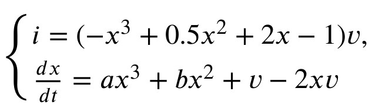
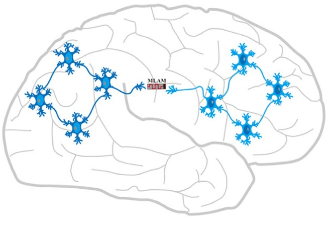

# Chaotic Dynamics and Synchronization of Multi-Region Neural Network Based on Locally Active Memristor

## Authors
- **Ertong Wang**  
  School of Future Technology, South China University of Technology, Guangzhou 510641, China  
  Pazhou Lab, Guangzhou 510006, China  
- **Bin Hu**  
  School of Future Technology, South China University of Technology, Guangzhou 510641, China  
  Pazhou Lab, Guangzhou 510006, China  
- **Zhi-Hong Guan**  
  School of Artificial Intelligence and Automation, Huazhong University of Science and Technology, Wuhan 430074, China  

## Abstract
This study investigates the influence of neural synapses on the collaboration of different brain regions. We propose a multi-region neural network (MRNN) using a multistable locally-active memristor (MLAM). The MLAM is designed to exhibit multistable, non-volatile, and locally-active properties, making it suitable for simulating biological neural synapses. The MRNN model, constructed by connecting two Hopfield neural networks (HNNs) with different weights via the MLAM synapse, demonstrates rich chaotic dynamics. Key findings include the alternation between chaos and period driven by synaptic coupling strength, self-boosting of attractors driven by internal parameters of the synapse, and the design of a feedback synchronization controller to achieve synchronization across multiple brain regions. These results provide valuable insights into the physiological activities of cognitive brain neural networks and their responses to different stimuli.

## Citation
If you find this work useful, please cite the original paper:
-@article{wang2025chaotic,
  -title={Chaotic dynamics and synchronization of multi-region neural network based on locally active memristor},
  -author={Wang, Ertong and Hu, Bin and Guan, Zhi-Hong},
  -journal={Chaos, Solitons \& Fractals},
  -volume={197},
  -pages={116437},
 -year={2025},
  -publisher={Elsevier}
}

## Keywords
- Memristor
- Locally-active
- Hopfield neural network (HNN)
- Chaos
- Synchronization

## Main Contributions
1. **Design of a new MLAM**: A novel multistable locally-active memristor is designed, exhibiting non-volatile properties and the ability to simulate biological neural synapses.
2. **Construction of MRNN**: The MLAM is modeled as a synapse connecting two HNNs with different weights, forming a new multi-region neural network (MRNN) that characterizes the collaboration between two brain regions.
3. **Chaotic Dynamics Analysis**: The MRNN exhibits rich chaotic behaviors, including alternation between chaos and period driven by synaptic coupling strength and self-boosting of attractors driven by internal parameters of the synapse.
4. **Synchronization Control**: A feedback synchronization controller is designed to synchronize two MRNNs with different firing patterns, demonstrating the relationship between synchronization and synaptic coupling strength/internal parameters.

## Model Description
### Multistable Locally-Active Memristor (MLAM)
The MLAM is modeled using the following equations:

  

where `a = -0.8`, `b = 2`, and `c = 2`. The MLAM exhibits multistable and non-volatile properties, making it suitable for simulating biological synapses.

### Multi-Region Neural Network (MRNN)
The MRNN is constructed by connecting two four-neuron Hopfield neural networks (HNNs) with different weights via the MLAM synapse. The dynamics of the MRNN are described by a system of differential equations involving membrane potentials and synaptic coupling strengths.

  

## Results
1. **Chaotic Dynamics**: The MRNN exhibits alternation between chaotic and periodic behaviors driven by variations in synaptic coupling strength (`α` and `β`).
2. **Self-Boosting of Attractors**: Internal parameters of the synapse drive the self-boosting of attractors in the phase space, a phenomenon not observed in previous studies.
3. **Synchronization**: A feedback controller is designed to achieve synchronization between two MRNNs with different firing patterns, demonstrating the role of synaptic coupling strength and internal parameters in neural synchronization.

## Usage
This repository contains the PDF file of the research paper. To reproduce the results, refer to the numerical simulations implemented in MATLAB using the Runge-Kutta algorithm with a step size of 0.01, as described in the paper.